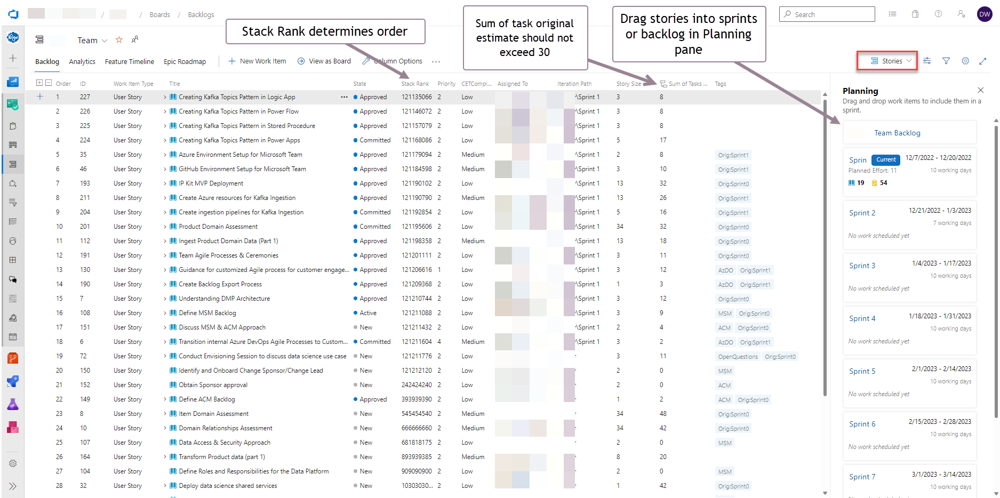
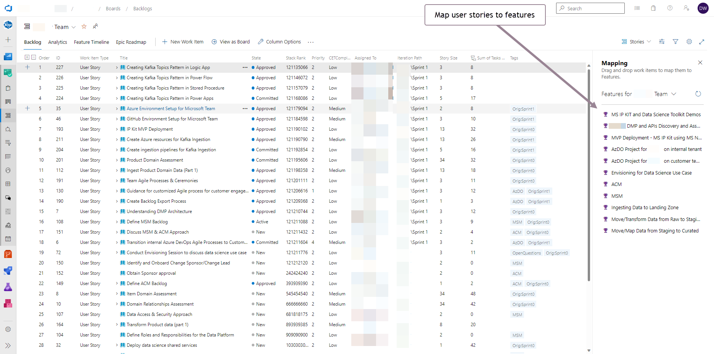
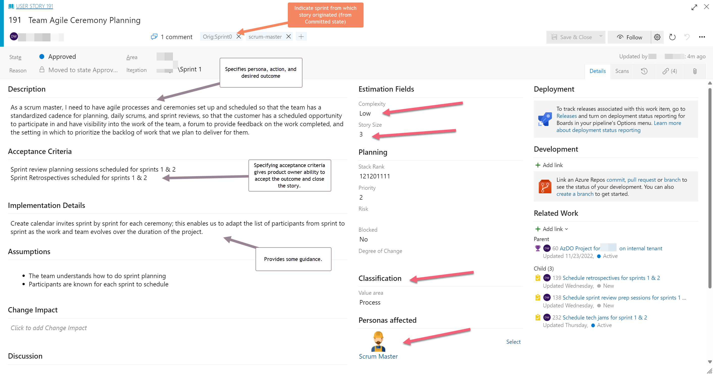

# Azure DevOps Sprint Planning Guidelines

## Draft Outline

- Timeline for initial planning work
- Timeline for story refinement
- Timeline for Tasking
- Timeline for committing to user stories for a sprint
- User Story: Approved status
- Why Acceptance Criteria are valuable.

-----------------------------------------

## Build out the backlog

For sprint planning purposes, you should not concern yourself too much with Epics and Features.  For Data Strategy engagements, the epics and features should be derived from the use case scenarios driven out of the workshops.  The user stories are the individual blocks from which we will build our customer's solution.

### The Backlog

In the backlog view, create user stories to capture each building block of work, which should never exceed a week's worth of effort (30 hours).  In the taskboard view's capacity section, your daily hours will never exceed 6, so for a typical week, 30 hours will be your total weekly hours.

For the purposes of planning, you should capture ALL forms of work required, including scheduling and participating in meetings, excluding Scrum ceremonies such as sprint planning, daily scrum, sprint review, sprint retrospective.  

Ideally, we would have user stories planned out multiple sprints, but this isn't always possible.  Do always try to capture work that needs to be done regardless of when you will be able to do it; that's what the backlog is for.

Try to put your user stories in stack rank order based on the order of importance in which that work needs to be done, such as dependencies.  As a group, we can reorder later based on group priorities.  To stack rank your user story, either drag the item into position or open the context menu for the item by selecting the elipsis next to the title and select "Move to position..."

When creating the user story, be sure to set the Story Size using the [story point guidelines](./AzDO.Guidelines.StoryPoints.md).  This is your range-based, approximate sizing for this area of work.

After creating a user story, be sure to map it to a parent feature.  We always want to have a tree of work items from task all the way up the chain to the Objective level.  This way, we can always trace our work back to a core objective as well as see aggregate progress from each level in the tree from the backlog view.  Note: the main dashboard includes indicators for orphaned tasks, user stories, and features so that we can quickly identify work items that are unmapped.

## What does a good user story look like?

A user story should be the smallest composable unit of **outcome** that you can define for a given persona, which might be you.  Starting with the **persona**, define the **action** needed to effect an **outcome** that adds real value to the customer by helping them achieve their goals in the description field.

### Tagging

After you assign a user story to a sprint, it is approved by the product owner, and you have committed to delivering the user story in the assigned sprint, you should tag the user story with the sprint in which the story was originally committed.  This tag would look like: Orig:SprintX.  This enables the scrum master to track user stories that get pushed out from their original sprint for internal LED reporting and tracking.

### Sizing / Points

Sizing a story allows you to estimate a relative range of effort before you break it down into tasks.  After some time, you should be able to estimate how many story points you can deliver in a sprint.
Story Size | ~effort days | ~effort hours
| - | - | -
0 | |
1 | 0 - 0.5d | 0 - 3h
2 | 0.5 - 1d | 3 - 6h
3 | 1 - 2d | 6 - 12h
5 | 2 - 3d | 12 - 18h
8 | 3 - 4d | 18 - 24h
13 | 4 - 5d | 24 - 30h
21 | 5 - 6d | 30 - 36h (decompose)
34 | 6 - 7d | 36 - 42h (decompose)

### Complexity

The relative complexity of the user story should be given a "T-Shirt" size of Low, Medium, or High.  You can ignore "Very Low."  The value of assigning a complexity level is that it helps with estimation.  For example, highly complex work areas will not only take longer to implement, but will also likely introduce additional risk, especially where the details of implementation aren't well understood or are unknown.

### Blocked

With the current style configuration on user stories, the card for stories marked Blocked=Yes will show red in the taskboard view to assist in visually identifying blocked stories during scrum calls.  In addition, the dashboard report includes a tile to help identify blocked stories in the current sprint.

### Description

User stories should always address one or more personas, although preferably just one in order to adequately address the specific needs of that persona.
Note the format of the description in the user story screen shot. Given the persona you are addressing for this story, an action needs to be taken to achieve a desired outcome or goal for the persona addressed.

### Acceptance Criteria

### Implementation Details

