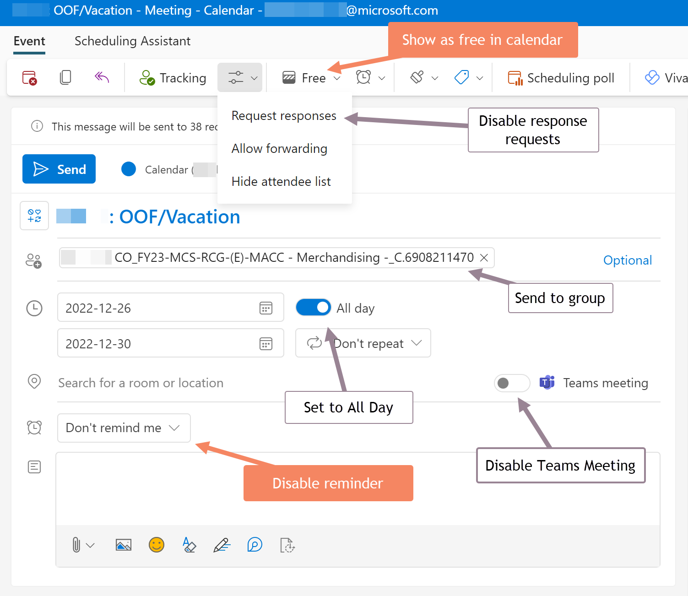

layout: page
title: "Scheduling OOF"
permalink: /AzureDevOps

## Guidance for communicating Time-Off in Outlook Calendar to the team
This pertains to holiday, vacation, sick-time, and emergent out-of-office situations:

## Setting OOF Auto Response Emails

### For Internal MS Recipients

### For External Recipients

## Communicating Time-Off in Azure DevOps

### Setting Sprint Capacity Days Off

### Holiday Days Off for Whole Team

### DevOps Calendar View

